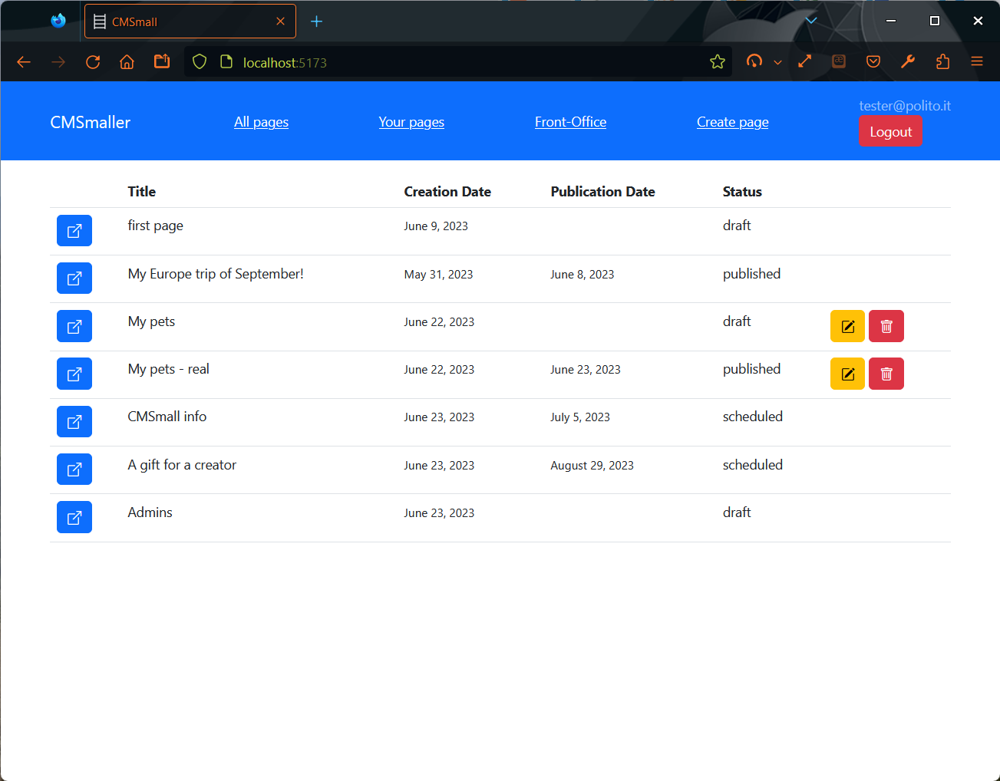
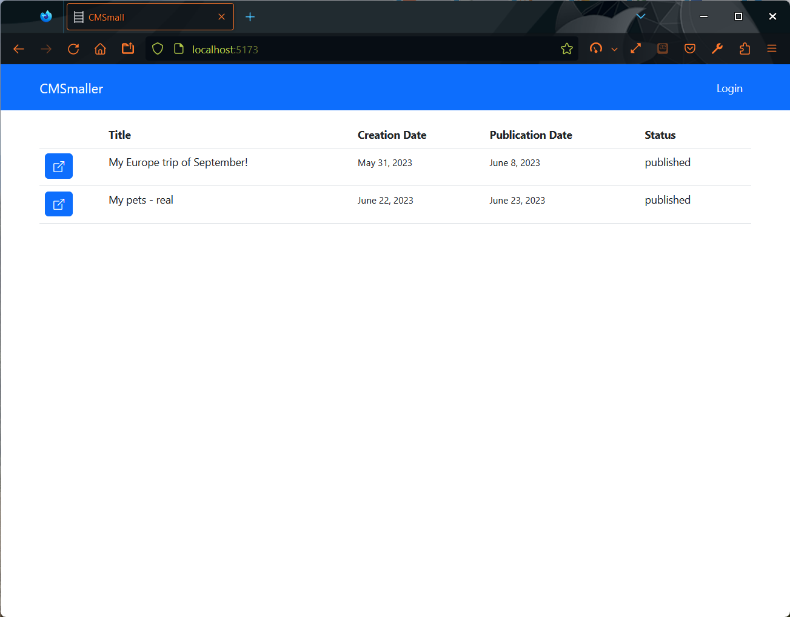
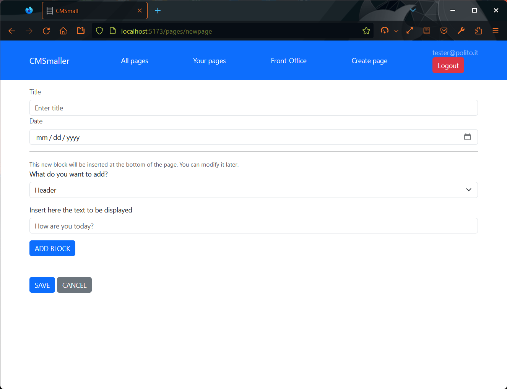

[](https://classroom.github.com/a/_XpznRuT)
# Exam #308692: "CMSmall"

## Student: s308692 CASTELLARIN FILIPPO

# Server side

## API Server

Legend:
  - Successful means `200`
  - Error in request is `400`
  - Unauthorized is `401`
  - Server/network errors are `500`.

### Public routes
- GET `/api/home`: Retrieve a list of published pages sorted by publication date.

  - Request Parameters: None
  - Response Body Content: JSON Array containing a list of pages.

- POST `/api/login`: Authenticate a user and establish a login session.

  - Request Parameters:
    - `username` (email): The username of the user.
    - `password` (string): The password of the user.
  - Response Body Content:
    - JSON Object containing user information if authentication is successful `{ id: user.id, email: user.email, role: user.role }`.
    - JSON Object containing an error message if authentication fails `{ error: info }`.

- GET `/api/pages/:pageId`: Retrieve the content of a specific page.

  - Request Parameters: None
  - Response Body Content: JSON Object containing the content of the page.
```json
[{
    "id": 14,
    "pageID": 2,
    "type": "header",
    "value": "A wonderful cat",
    "level": 4
  },
  {
    "id": 15,
    "pageID": 2,
    "type": "image",
    "value": "cat.jpeg",
    "level": 5
  }
]
```

- GET `/api/pageinfo/:pageId`: Retrieve information about a specific page.

  - Request Parameters: None
  - Response Body Content: JSON Object containing the information of the page.
```json
{
  "id": 2,
  "title": "My Europe trip of September!",
  "authorID": 3,
  "creationDate": "2023-05-30T22:00:00.000Z",
  "publicationDate": "2023-06-07T22:00:00.000Z"
}
```


- GET `/api/authors/:authorId`: Retrieve email of a specific author.

  - Request Parameters: None
  - Response Body Content: JSON Object containing the email of the author `{"tester@polito.it"}`.

- POST `/api/logout`: Perform a logout and end the current login session.

  - Request Parameters: None
  - Response Body Content: None

- GET `/api/webname`: Retrieve the name of the website.

  - Request Parameters: None
  - Response Body Content: JSON Object containing the name of the website `{"CMSmaller"}`.

### Restricted routes
- GET `/api/pages`: Retrieve a list of pages.

  - Request Parameters: None
  - Response Body Content: JSON Array containing a list of pages.
```json
[
  {
    "id": 1,
    "title": "first page",
    "authorID": 2,
    "creationDate": "2023-06-08T22:00:00.000Z",
    "publicationDate": null
  },
  {
    "id": 2,
    "title": "My Europe trip of September!",
    "authorID": 3,
    "creationDate": "2023-05-30T22:00:00.000Z",
    "publicationDate": "2023-06-07T22:00:00.000Z"
  }, ...
]
```

- POST `/api/create`: Create a new page.

  - Request Parameters:
    - `title` (string, required): The title of the page.
    - `publicationDate` (string, optional): The publication date of the page.
    - `content` (array, required): An array of objects representing the page content. Each object should have the following properties:
      - `type` (string): The type of content ("header", "image", or "paragraph").
      - `value` (string): The value of the content.
  - 
  ```json
    "publicationDate": "2023-06-21",
    "title": "title"
    "content": [
      {"type":"header", "value":"An header"},
      {"type":"paragrapg", "value":"Some text"}
    ]
  ```
  - Response Body Content: None

- PUT `/api/pages/:pageId/edit`: Edit an existing page.

  - Request Parameters:
    - `title` (string, optional): The new title of the page.
    - `publicationDate` (string, optional): The new publication date of the page.
    - `email` (string, optional): The email of the new author (only for admin role).
    - 
    ```json
    {
      "publicationDate": "2023-06-21",
      "title": "title"
    }
    ```
  - Response Body Content: None

- DELETE `/api/:pageId/delete`: Delete a page.

  - Request Parameters: None
  - Response Body Content: None

- PUT `/api/increase/:contentId`: Increase the position of a content item.

  - Request Parameters: None
  - Response Body Content: None

- PUT `/api/decrease/:contentId`: Decrease the position of a content item.

  - Request Parameters: None
  - Response Body Content: None

- PUT `/api/pages/:pageId/editContent/:contentId`: Edit the value of a content item.

  - Request Parameters:
    - `value` (string): The new value of the content item.
  - Response Body Content: None

- DELETE `/api/pages/:pageId/deleteContent/:contentId`: Delete a content item from a page.

  - Request Parameters: None
  - Response Body Content: None

- POST `/api/pages/:pageId/addContent`: Add a new content item to a page.

  - Request Parameters:
    - `content` (object): An object representing the new content item. It should have the following properties:
      - `type` (string): The type of content ("header", "image", or "paragraph").
      - `value` (string): The value of the content.
    - 
    ```json
    {
      "type": "paragraph", 
      "value": "value"
    } 
    ```
  - Response Body Content: None

- PUT `/api/editWebname`: Edit the website name.

  - Request Parameters:
    - `name` (string): The new name of the website.
  - Response Body Content: None

- GET `/api/allAuthors`: Retrieve a list of all authors' email addresses (only for admin role).

  - Request Parameters: None
  - Response Body Content: JSON Array containing a list of email addresses `{["tester@polito.it", "filippo@polito.it", ...]}`.

## Database Tables

- Table `users`: to store user info
  - `id`: autoincremental value assigned univoquely to users
  - `email`: is the username
  - `password`: user's password hashed with the `salt`
  - `salt` (see above)
  - `role`: indicates which are user's privileges:
    - admin: see specifications
    - creator: see specifications

- Table `pages`: to store pages info
  - `pageID` (autoincrement)
  - `title`
  - `author`
  - `creationDate` (automatic)
  - `publicationDate` (NULL until setting it)

- Table `contents`: to store the content of the pages
  - `contentID`: grant univocity 
  - `pageID`: to which the content belongs to
  - `type`: [image, header, paragraph]
  - `value`: value (image name for images, text for the others) 
  - `level`: NUMBER (from 0)

- Table `CMSWebname`: to store the name of the website that the admin can modify
  - `name`: Name of the website


# Client side
## React Client Application Routes

- Route `/`: it's the index: if user is logged, then here are displayed all pages, otherwise just the *published* pages.
- Route `/login`: it's where the login form is displayed. 
- Route `/yourpages`: filter pages according to the user's ones (user must be logged in).
- Route `/front-office`: for authenticated users to get back to the *front-office* view in which editing and creating a new page is not permitted.
- Route `/pages/:pageId`: to access the content of the page with `id` = `pageId`. If user is logged in then it can edit the page (if he is the author), otherwise just have a look at the content.
- Route `/pages/newpage`: accessible just to logged in users. It's a page with a form to create a new page and add the content in it.
- Route `/pages/editpage/:pageId`: route to access a page and edit its main information (title, author (if admin), publicationDate).

## Main React Components

- `PageList` (in `PageList.jsx`): render the table with all published pages / all pages (depending on props.pages that receives from App.jsx)
- `PageInfo` (in `PageContent.jsx`): manages all what concerns the editing of the content in the page: move blocks, change content of block and delete a block. It's made up with other minor components that manages the render of the page DURING EDITING.
- `EditPage` (in `EditPage.jsx`): is responsible of changing the main info of a page: the title and the publication date, and if an admin acesses to it, then also the author.
- `CreatePage` (in `CreatePage.jsx`): creates the page and permits adding/editing blocks of the new page. Nothing is propagated to the server until the user clicks on the 'SAVE' button.
- `PageContent` (in `ContentView.jsx`): here have been decided the choices on how to display the content (blocks) during the view and the editing phase.
- `Login` (in `Login.jsx`): contains the form to handle the login procedure: the form and the upcall to handleLogin function in `App.jsx`. 

<!-- (only _main_ components, minor ones may be skipped) -->

# Usage info
## Example Screenshot







## Users Credentials
> USERNAME: emails  
> ROLES: creator, admin

- tester@polito.it, *password*, creator
- filippo@polito.it, *secure*, admin
- creator@polito.it, *polito*, creator
- lazy@polito.it, *iamlazy*, creator [must have 0 pages]

<!-- - username, password (plus any other requested info)
- username, password (plus any other requested info) -->


> 16-salt generator: https://www.browserling.com/tools/random-hex  
> 32-hash generator: https://www.browserling.com/tools/scrypt